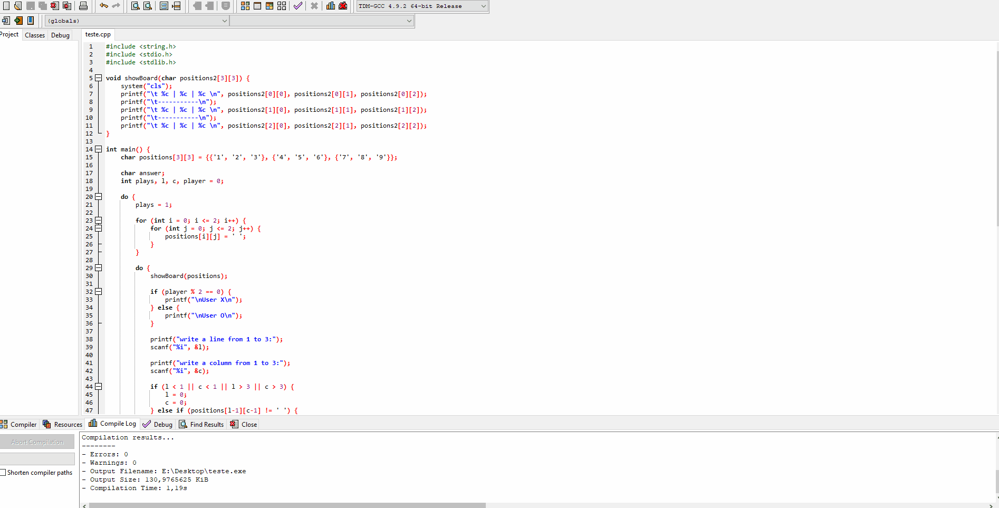

# 💻 Tic Tac Toe

<p align="center">This project is a basic game...</p>

<br/>

# 📓 Contents:

- About
    - [Features](#Features)
- Contents,
- How to use
    - [Prerequisites](#Prerequisites)
    - [Running the project](#Running-the-project)
- Tests,
- Technologies,
- Icons.

<br/>

# About:

### Features:

- [x] Create Title
- [x] Create Project
- [x] Create Description
- [x] Performed Tests

<br/>

# 📝 How to use:

<br/>

### Prerequisites:

You need to have the following tools installed on your machine: [Git](https://git-scm.com) and [Dev-C++](https://sourceforge.net/projects/orwelldevcpp/)

<br/>

### Running the project:

```bash
# Clone this repository
$ git clone <https://github.com/bortolettojoaog/tic_tac_toe.git>

# Open the project in dev-c

# Compile the project by clicking the button or pressing `F11`

# Play the game
```

<br/>

# ✔️ Tests:
<h1 align="center">
    
</h1>

<br/>

# 🛠️ Technologies:

The following tools were used in building the project:

- [C++](https://pt.wikipedia.org/wiki/C%2B%2B)
- [Dev-C++](https://sourceforge.net/projects/orwelldevcpp/)

<br/>

# 📁 Icons:

- :package: new functionality
- :up: update
- :bug: bug fix
- :checkered_flag: release

<br/>

---

<p align="center">
    Made with ❤️ by João Guilherme Bortoletto 👋
</p>

<p align="center">
    <a href="https://www.linkedin.com/in/bortolettojoaog/">See my LinkedIn</a>
</a>